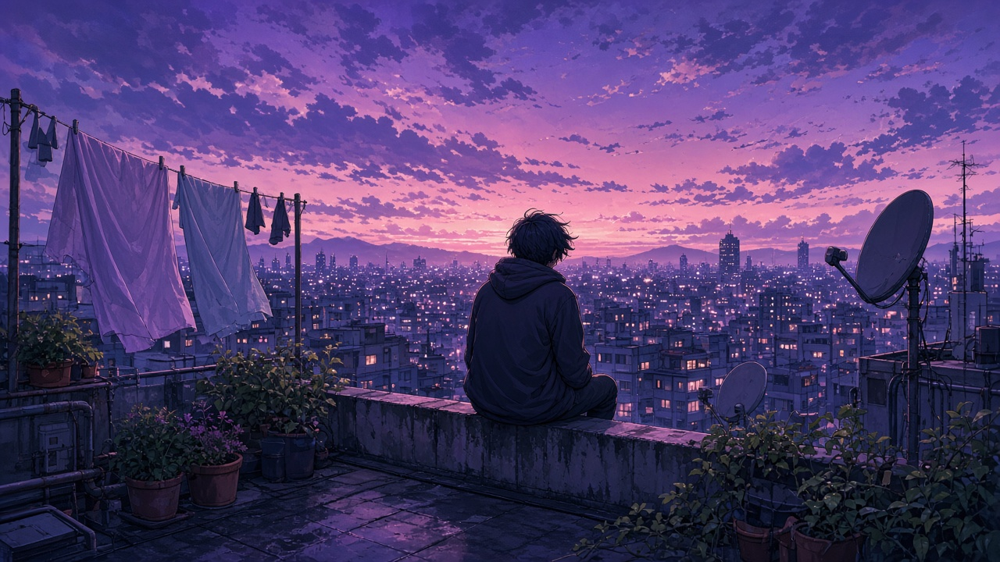

<div align="center">

# AnimeWallpaperX

**Beim Start ein neues Anime-Bild. Dazu ein Gedanke, der einen Moment hält.**

Ein kleines Linux-Programm wechselt bei jedem Aufruf den Desktop-Hintergrund  
und zeigt einen kurzen Satz zum Bild — im Terminal und, wenn vorhanden, als Benachrichtigung.

<br>

[Desktop-App](#desktop-app) · [Starten](#starten) · [Sammlung](#die-sammlung) · [Autostart](#bei-jedem-anmelden) · [Bauen](#selbst-bauen)

</div>

---

## Desktop-App

Die installierbare App ist mit **Tauri 2** gebaut. Im Fenster stellst du zwei Schalter:

- **App an/aus** — legt fest, ob AnimeWallpaperX beim Anmelden startet.
- **Hintergrund an/aus** — legt fest, ob bei jedem Start ein anderes Bild gesetzt wird.

„Jetzt wechseln“ setzt sofort ein neues Bild und zeigt den passenden Gedanken.

Das Installationspaket liegt unter [Releases](https://github.com/Pikaswelt/AnimeWallpaperX/releases). Auf Debian und Ubuntu:

```bash
sudo apt install ./AnimeWallpaperX_1.0.0_amd64.deb
```

Danach steht AnimeWallpaperX im Anwendungsmenü.

---

## Starten

Die Datei `AnimeWallpaperX` ist bereits gebaut. In einer grafischen Sitzung:

```bash
./AnimeWallpaperX
```

Jedes Mal ein anderes Bild, nie zweimal hintereinander dasselbe.

| Aufruf | Wirkung |
| --- | --- |
| `./AnimeWallpaperX` | Bild setzen und den Gedanken zeigen |
| `./AnimeWallpaperX --list` | Alle Bilder und Gedanken anzeigen |
| `./AnimeWallpaperX --dry-run` | Nur auswählen, den Desktop nicht anfassen |
| `./AnimeWallpaperX --autostart` | Beim Anmelden automatisch starten |
| `./AnimeWallpaperX --help` | Kurze Hilfe |

---

## Die Sammlung

Zwölf Hintergründe, jeder mit einem eigenen Gedanken.

<table>
<tr>
<td width="33%" align="center">
<br>
<b>Kirschblüte</b><br>
<em>Was langsam fällt, muss nicht verloren gehen. Manches bleibt, weil du stehen bleibst.</em>
</td>
<td width="33%" align="center">
<br>
<b>Neonregen</b><br>
<em>Auch eine laute Stadt hat stille Ecken. Such dir eine, und atme, bis der Regen nur noch Regen ist.</em>
</td>
<td width="33%" align="center">
<br>
<b>Wolkentempel</b><br>
<em>Du musst nicht alles sehen, um anzukommen. Manchmal reicht ein Licht über den Wolken.</em>
</td>
</tr>
<tr>
<td align="center">
<br>
<b>Leuchtturm</b><br>
<em>Ein kleines Licht reicht weit, wenn das Meer dunkel ist. Sei dieses Licht, auch für dich selbst.</em>
</td>
<td align="center">
<br>
<b>Nachtzug</b><br>
<em>Nicht jeder Weg braucht ein Ziel in dieser Stunde. Manche Nächte sind nur dazu da, dich weiterzutragen.</em>
</td>
<td align="center">
<br>
<b>Ahornwald</b><br>
<em>Loslassen kann bunt sein. Was du hergibst, macht Platz für das, was als Nächstes wachsen will.</em>
</td>
</tr>
<tr>
<td align="center">
<br>
<b>Dachgarten</b><br>
<em>Von oben sieht das Durcheinander kleiner aus. Steig hin und wieder hoch, nur um zu schauen.</em>
</td>
<td align="center">
<br>
<b>Schneedorf</b><br>
<em>Wärme ist kein Ort, sondern jemand, der das Fenster für dich anlässt.</em>
</td>
<td align="center">
<br>
<b>Inselreich</b><br>
<em>Deine Welt darf größer sein als dein Tag. Lass einen Rand offen, an dem noch Inseln Platz haben.</em>
</td>
</tr>
<tr>
<td align="center">
<br>
<b>Bibliothek</b><br>
<em>Du musst nicht jede Seite heute lesen. Es genügt, das Buch aufzuschlagen und dazubleiben.</em>
</td>
<td align="center">
<br>
<b>Sommerfest</b><br>
<em>Freude wird nicht kleiner, wenn du sie teilst. Sie wird nur leichter zu tragen.</em>
</td>
<td align="center">
<br>
<b>Regencafé</b><br>
<em>Pause ist kein Rückschritt. Ein warmer Tisch am Fenster zählt auch als Weiterkommen.</em>
</td>
</tr>
</table>

Neue Bilder legst du als `.png` oder `.jpg` in den Ordner `wallpapers/` neben das Programm. AnimeWallpaperX nimmt sie beim nächsten Start mit.

---

## Bei jedem Anmelden

```bash
./AnimeWallpaperX --autostart
```

Damit liegt ein Starter unter `~/.config/autostart/`. Ab dem nächsten Login wechselt das Bild von selbst.

---

## Desktops

Das Programm erkennt die laufende Sitzung und setzt das Bild dort, wo es kann:

GNOME · Cinnamon · MATE · XFCE · KDE Plasma · Sway · Hyprland  
sowie feh, nitrogen, pcmanfm und xwallpaper

Die letzte Wahl steht in `~/.config/AnimeWallpaperX/letzte`, damit der nächste Start ein anderes Bild nimmt.

---

## Selbst bauen

```bash
make
./AnimeWallpaperX
```

Es braucht nur `gcc`. Das fertige Programm sucht die Bilder immer neben sich, im Ordner `wallpapers/`.

---

<div align="center">

<sub>AnimeWallpaperX · ein Bild, ein Gedanke, ein stiller Start.</sub>

</div>
